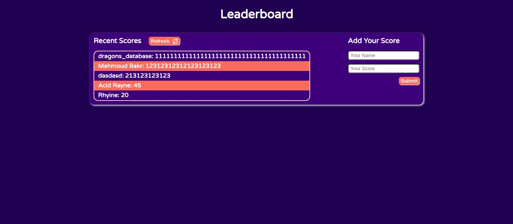

# Project Name

Leaderboard Website

This is a leaderboard website that displays scores submitted by different players. It also allows users to submit their scores. All data is preserved using the external Leaderboard API service.

# Screenshots

## Built With

- 
- 
- 
- 

## Live Demo
You can see my page live here: 
[Check it out!](https://the-catalystmc.github.io/leaderboard/dist/index.html)

## Getting Started

To get a local copy up and running follow these simple example steps. You can either download the zip file, or clone the repository from [here](https://github.com/the-catalystmc/leaderboard). 
 Once the repository is available locally you can use:
`npm install` to install the packages
`npm run start` to run the server on local server 

## Author
👤 **Rhyine Stewart**

- GitHub: [@githubhandle](https://github.com/the-catalyst-mc)
- Twitter: [@twitterhandle](https://twitter.com/catalystspeaks)
- LinkedIn: [LinkedIn](https://linkedin.com/in/rhyinestewart)

## 🤝 Contributing

Contributions, issues, and feature requests are welcome!

Feel free to check the [issues page](https://github.com/the-catalystmc/leaderboard/issues).

## Show your support

Give a ⭐️ if you like this project!